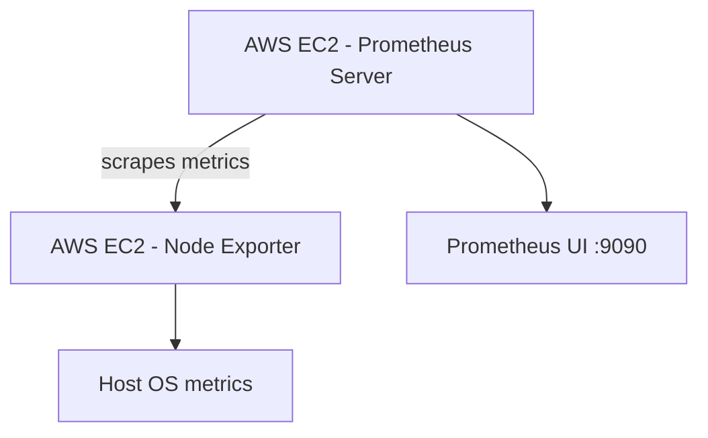

# Prometheus Monitoring Stack on Ubuntu (Prometheus + Node Exporter)

## Overview

This directory demonstrates how to set up a monitoring infrastructure using Prometheus and Node Exporter on Ubuntu EC2 instances in the AWS cloud. The project involves installing Prometheus as a service on one EC2 instance and Node Exporter on another EC2 instance. Prometheus collects metrics from Node Exporter, providing insights into the health and performance of both the infrastructure itself and the monitored servers.

The documentation here merges:

- A high-level scenario for Prometheus + Node Exporter.
- A detailed walkthrough of the Prometheus installation script and its systemd integration.

## Contents

- `install_prometheus_ubuntu.sh` – Automated installer for Prometheus Server on Ubuntu (binaries, configuration, user, permissions, and systemd service).
- `install_prometheus_node_exporter.sh` – Installer for Prometheus Node Exporter on Ubuntu.
- `README.md` – This combined guide for installing, configuring, and validating Prometheus and Node Exporter.

## Architecture



- **Prometheus Server** runs as a systemd service on one Ubuntu EC2 instance.
- **Node Exporter** runs as a systemd service on another Ubuntu EC2 instance and exposes host metrics on port `9100`.
- Prometheus scrapes metrics from both itself and Node Exporter.

## Prerequisites

- An AWS account.
- Two Ubuntu 22.04 EC2 instances (one for Prometheus, one for Node Exporter).
- Security groups/open firewall rules allowing:
  - Port `9090` (Prometheus UI) from your admin machine.
  - Port `9100` (Node Exporter) from the Prometheus instance.
- `sudo` privileges on both instances.
- Basic command-line tools such as `curl`, `wget`, and `tar` (the installer script will handle most dependencies).

## Step 1 – Launch Two Ubuntu Instances

1. In AWS, provision two Ubuntu 22.04 EC2 instances.
2. Assign appropriate security groups so that:
   - You can access the Prometheus instance on port `9090`.
   - The Prometheus instance can reach the Node Exporter instance on port `9100`.

## Step 2 – Install Prometheus Server

On the instance that will host Prometheus:

1. Copy or clone the script to the server and change into its directory.

2. Make the installation script executable:

   ```bash
   chmod +x install_prometheus_ubuntu.sh
   ```

3. Run the installation script with superuser privileges:

   ```bash
   sudo bash install_prometheus_ubuntu.sh
   ```

### What the Script Does

The Prometheus installation script performs the following actions:

1. **Download Prometheus**
   - Downloads the specified version of Prometheus from GitHub.
   - Extracts the downloaded tarball.
   - Moves the Prometheus binaries into `/usr/bin/` for system-wide access.
   - Cleans up temporary files.

2. **Configuration**
   - Creates the configuration directory `/etc/prometheus`.
   - Creates the data directory `/etc/prometheus/data` (or equivalent, depending on script version).
   - Generates a basic `prometheus.yml` configuration file.

3. **User and Permissions**
   - Creates a system user named `prometheus` with restricted shell access.
   - Sets ownership of Prometheus directories and files to the `prometheus` user and group.

4. **systemd Service Configuration**
   - Creates a systemd service unit file `prometheus.service`.
   - Configures the service to run as the `prometheus` user.
   - Enables automatic restart on failure.
   - Starts Prometheus with the generated configuration file and data directory.

5. **Systemd Management**
   - Reloads systemd to pick up the new service unit.
   - Starts the `prometheus` service and enables it to start automatically on boot.

### Verification (Prometheus Server)

After the script completes:

```bash
systemctl status prometheus
prometheus --version
```

You should also be able to access the Prometheus UI at:

```text
http://<PROMETHEUS_INSTANCE_PUBLIC_IP>:9090/
```

## Step 3 – Install Node Exporter

On the second Ubuntu instance (the one to be monitored):

1. Copy or clone the script to the server and change into its directory.

2. Make the Node Exporter installation script executable:

   ```bash
   chmod +x install_prometheus_node_exporter.sh
   ```

3. Run the installation script with superuser privileges:

   ```bash
   sudo bash install_prometheus_node_exporter.sh
   ```

Typical responsibilities of this script include:

- Downloading and unpacking the Node Exporter binary.
- Creating a dedicated system user (often `node_exporter`).
- Creating a systemd service unit (for example, `node_exporter.service`).
- Starting the Node Exporter service and enabling it on boot.

Verify that Node Exporter is running and listening on port `9100`:

```bash
systemctl status node_exporter
curl http://localhost:9100/metrics
```

## Step 4 – Configure Prometheus Server

On the Prometheus host, configure Prometheus to scrape itself and the Node Exporter instance.

1. Navigate to the Prometheus configuration directory:

   ```bash
   cd /etc/prometheus
   ```

2. Edit the `prometheus.yml` configuration file according to your monitoring requirements. A minimal example looks like this (replace the IP address as appropriate):

```yaml
global:
  scrape_interval: 15s

scrape_configs:
  - job_name: "prometheus"
    static_configs:
      - targets: ["localhost:9090"]

  - job_name: "ubuntu-server"
    static_configs:
      - targets:
          - 172.31.31.254:9100
```

Explanation:

- **Global scrape interval** – Prometheus will collect metrics every 15 seconds.
- **`prometheus` job** – Scrapes the Prometheus server itself on `localhost:9090` to monitor its own health and performance.
- **`ubuntu-server` job** – Scrapes the Node Exporter running on `172.31.31.254:9100` (replace with the private IP of your monitored Ubuntu server).

## Step 5 – Restart Prometheus Service

After updating `prometheus.yml`, restart Prometheus to apply the configuration:

```bash
sudo systemctl restart prometheus
systemctl status prometheus
```

Then open the Prometheus UI and navigate to **Status → Targets**. You should see:

- `prometheus` target – Up
- `ubuntu-server` target – Up

## Step 6 – Query Metrics from Node Exporter

In the Prometheus UI (at `http://<PROMETHEUS_INSTANCE_PUBLIC_IP>:9090/`):

1. Go to the **Graph** tab.
2. Enter PromQL expressions such as:

   - `node_cpu_seconds_total`
   - `node_network_receive_packets_total`
   - `node_filesystem_avail_bytes`

3. Adjust the time range (e.g., last 15 or 30 minutes) and execute the queries.

These metrics help you understand CPU utilization, network throughput, and filesystem capacity over time.

## Results

1. **Prometheus Targets:**

   The Prometheus Targets page lists monitored endpoints, including the Prometheus server itself and the Ubuntu server running Node Exporter. Both targets should be `UP` and successfully scraped by Prometheus.

2. **Example Graphs:**

   - `node_cpu_seconds_total` for the last 30 minutes shows cumulative CPU time per core and helps identify CPU utilization patterns.
   - `node_network_receive_packets_total` for the last 15 minutes shows the total number of received network packets, useful for understanding traffic volume and spotting anomalies.

## Repository Context

This directory is part of the monitoring suite under `install-monitoring-tools/` in the Bash Automation Scripts Collection. For a full overview of repository modules and other automation scripts, see the root `README.md` in the repository root.
